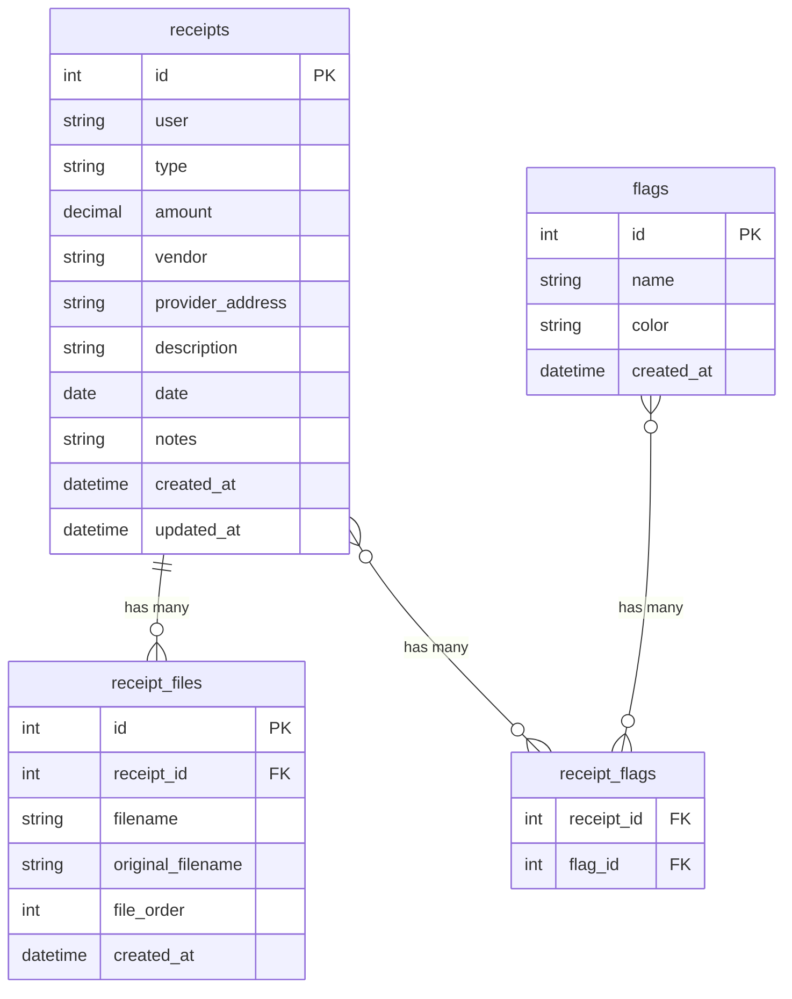

# MedStash

## Architecture Overview

A full-stack application with React frontend and Node.js/Express backend, storing receipts as files on the filesystem with metadata in SQLite. Designed to meet HSA recordkeeping requirements with support for multiple files per receipt and custom flagging system.

```
┌─────────────┐         ┌──────────────┐         ┌─────────────┐
│   React     │ ──────> │   Express    │ ──────> │   SQLite    │
│  Frontend   │         │    API      │         │  (metadata) │
│  (Vite)     │         │             │         └─────────────┘
└─────────────┘         │             │
                        │             │         ┌─────────────┐
                        │             │ ──────> │ Filesystem  │
                        │             │         │  (receipts) │
                        └─────────────┘         └─────────────┘
```

## Project Structure

```
/
├── frontend/
│   ├── src/
│   │   ├── components/
│   │   │   ├── ui/              # shadcn components
│   │   │   ├── ReceiptUpload.tsx
│   │   │   ├── ReceiptList.tsx
│   │   │   └── ReceiptCard.tsx
│   │   ├── pages/
│   │   │   ├── UploadPage.tsx
│   │   │   ├── ReceiptsPage.tsx
│   │   │   └── SettingsPage.tsx
│   │   ├── lib/
│   │   │   ├── api.ts           # API client
│   │   │   └── utils.ts
│   │   ├── App.tsx
│   │   └── main.tsx
│   ├── package.json
│   ├── vite.config.ts
│   ├── tailwind.config.js
│   ├── components.json          # shadcn config
│   └── Dockerfile
├── backend/
│   ├── src/
│   │   ├── routes/
│   │   │   ├── receipts.ts      # CRUD for receipts
│   │   │   ├── settings.ts      # Users, types config
│   │   │   └── export.ts        # Bulk export
│   │   ├── services/
│   │   │   ├── receiptService.ts
│   │   │   ├── fileService.ts   # File ops, optimization
│   │   │   └── dbService.ts     # SQLite operations
│   │   ├── models/
│   │   │   └── receipt.ts       # Type definitions
│   │   ├── utils/
│   │   │   └── filename.ts      # Filename generation
│   │   ├── server.ts
│   │   └── db.ts                # DB initialization
│   ├── package.json
│   └── Dockerfile
├── docker-compose.yml
├── docker-compose.dev.yml       # Dev with file watching
├── .dockerignore
└── README.md
```

## HSA Recordkeeping Compliance

MedStash is designed to meet IRS HSA recordkeeping requirements. Each receipt must include:

- **Date of Service**: Date when the medical service/item was received (`date` field)
- **Service Provider Name**: Name of the healthcare provider or vendor (`vendor` field)
- **Service Provider Address**: Full address of the provider (`provider_address` field)
- **Detailed Description**: Description of the service or item purchased (`description` field)
- **Amount Paid**: Total amount paid for the service/item (`amount` field)

All receipts are retained indefinitely as HSA distributions can be taken years after the expense is incurred. The system stores both the receipt files and structured metadata to ensure compliance.

## Implementation Details

### Backend ([backend/src/](backend/src/))

**Database Schema** (SQLite):

- `receipts`: id, user, type, amount, vendor, provider_address, description, date, notes, created_at, updated_at
- `receipt_files`: id, receipt_id, filename, original_filename, file_order, created_at
- `flags`: id, name, color (optional), created_at
- `receipt_flags`: receipt_id, flag_id (many-to-many junction table)
- `settings`: key, value (JSON) - stores users list, receipt types, etc.

**Database Relationships**:



**HSA Compliance Fields** (per IRS guidelines):

- Date of service: `date`
- Service provider name: `vendor`
- Service provider address: `provider_address`
- Detailed description: `description`
- Amount paid: `amount`

**File Storage**:

- Store in `/data/receipts/` (mounted volume)
- Each receipt can have multiple files (0:N relationship)
- Files stored in receipt-specific subdirectories: `/data/receipts/{receipt_id}/`
- Filename format per file: `YYYY-MM-DD_user_vendor_amount_type_{index}.ext`
- Sanitize filenames (remove special chars, handle spaces)
- Image optimization: Convert images to WebP with 85% quality using `sharp`
- Preserve PDFs as-is

**API Endpoints**:

- `GET /api/receipts` - List all receipts (with filters, flags)
- `POST /api/receipts` - Create receipt with multiple files (multipart/form-data)
- `GET /api/receipts/:id` - Get receipt details with files and flags
- `PUT /api/receipts/:id` - Update receipt metadata
- `POST /api/receipts/:id/files` - Add additional files to existing receipt
- `DELETE /api/receipts/:id` - Delete receipt and all associated files
- `GET /api/receipts/:id/files/:fileId` - Download specific receipt file
- `PUT /api/receipts/:id/flags` - Update flags for receipt (array of flag IDs)
- `GET /api/flags` - List all custom flags
- `POST /api/flags` - Create new flag
- `PUT /api/flags/:id` - Update flag
- `DELETE /api/flags/:id` - Delete flag
- `GET /api/settings` - Get settings
- `PUT /api/settings` - Update settings (users, types)
- `GET /api/export` - Generate zip archive of all receipts

### Frontend ([frontend/src/](frontend/src/))

**Pages**:

- **Upload Page**: Drag-and-drop multiple file upload with form for HSA-compliant metadata (user, type, amount, vendor, provider_address, description, date, notes) and flag selection
- **Receipts Page**: List view with search/filter by flags, receipt cards showing preview/thumbnail, display all files per receipt
- **Settings Page**: Manage users list, receipt types, custom flags (create/edit/delete), view storage stats

**Key Components**:

- `ReceiptUpload`: File input with drag-drop, metadata form
- `ReceiptList`: Grid/list view with filters
- `ReceiptCard`: Display receipt info with thumbnail/preview
- shadcn components: Button, Card, Input, Select, Dialog, Table, etc.

**Tech Stack**:

- Vite for build tooling
- React Router for navigation
- react-hook-form for forms
- Tailwind CSS (via shadcn)
- axios or fetch for API calls

### Docker Setup

**Development** (`docker-compose.dev.yml`):

- Frontend: Vite dev server with volume mount for hot reload
- Backend: Node with nodemon for file watching
- SQLite: Volume mount for persistence
- Receipts: Volume mount to `/data/receipts`

**Production** (`docker-compose.yml`):

- Frontend: Build static files, serve via nginx or Express static
- Backend: Production Node.js
- Same volume mounts for data persistence

### File Naming Logic

Format: `YYYY-MM-DD_user_vendor_amount_type_{index}.ext`

Example: `2024-01-15_john-smith_cvs_25.50_prescription_0.pdf`, `2024-01-15_john-smith_cvs_25.50_prescription_1.jpg`

- Sanitize: lowercase, replace spaces with hyphens, remove special chars
- Index: Sequential number (0, 1, 2...) for multiple files per receipt
- Files stored in receipt-specific directory: `/data/receipts/{receipt_id}/`

### Image Optimization

- Use `sharp` library
- Convert JPEG/PNG to WebP format
- Quality: 85%
- Preserve aspect ratio
- Keep original if optimization fails

### Export Functionality

- Generate zip archive using `archiver`
- Include all receipt files
- Optionally include metadata CSV/JSON
- Stream response for large exports

## Key Files to Create

1. **Backend**:

   - `backend/src/server.ts` - Express app setup
   - `backend/src/db.ts` - SQLite initialization and schema (receipts, receipt_files, flags, receipt_flags)
   - `backend/src/routes/receipts.ts` - Receipt CRUD endpoints with multiple files and flags
   - `backend/src/routes/flags.ts` - Flags CRUD endpoints
   - `backend/src/services/fileService.ts` - File operations and optimization
   - `backend/src/utils/filename.ts` - Filename generation logic

2. **Frontend**:

   - `frontend/src/pages/UploadPage.tsx` - Upload interface
   - `frontend/src/pages/ReceiptsPage.tsx` - Receipts list
   - `frontend/src/pages/SettingsPage.tsx` - Settings management
   - `frontend/src/lib/api.ts` - API client functions

3. **Docker**:

   - `docker-compose.yml` - Production setup
   - `docker-compose.dev.yml` - Development with hot reload
   - `frontend/Dockerfile` - Frontend container
   - `backend/Dockerfile` - Backend container

## Dependencies

**Backend**:

- express, cors, multer (file uploads)
- better-sqlite3 (SQLite)
- sharp (image optimization)
- archiver (zip export)

**Frontend**:

- react, react-dom, react-router-dom
- @radix-ui/* (shadcn dependencies)
- tailwindcss, class-variance-authority
- vite, typescript

## Custom Flags System

- Flags are user-defined tags for categorizing receipts
- Created and managed in Settings page
- Each flag has: name, optional color
- Receipts can have 0 to N flags (many-to-many relationship)
- Flags can be used for filtering and searching receipts
- Flags are stored in `flags` table with junction table `receipt_flags`

## Data Flow

1. **Upload**: User selects multiple files → Frontend sends multipart/form-data with metadata and flag IDs → Backend validates → Create receipt record → For each file: optimize image if needed → Generate filename → Save to receipt directory → Store file metadata in `receipt_files` → Link flags via `receipt_flags` → Return receipt object with files
2. **List**: Frontend requests receipts (optionally filtered by flags) → Backend queries SQLite with joins → Returns JSON with files and flags → Frontend renders cards
3. **Export**: Frontend requests export → Backend reads all receipt files from directories → Creates zip with organized structure → Streams to client

