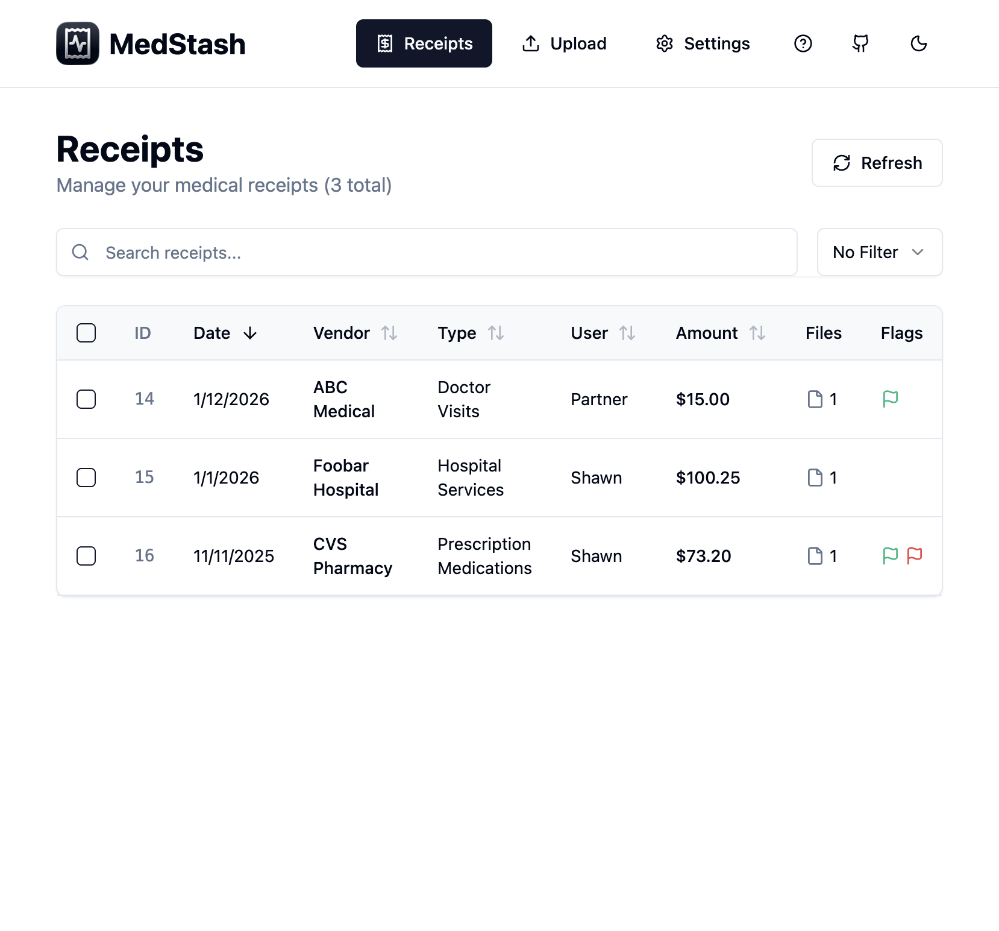
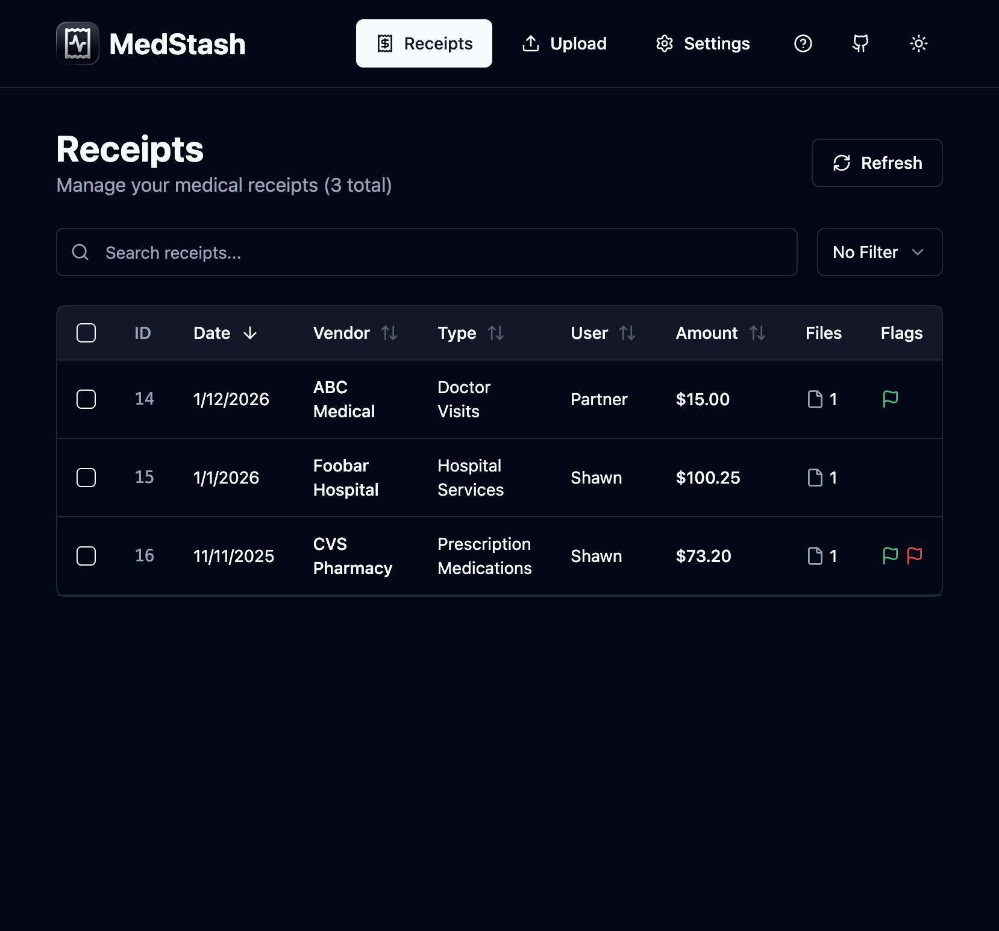
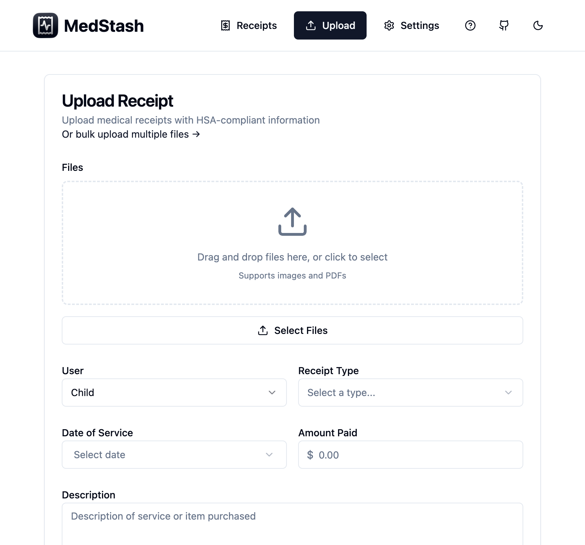
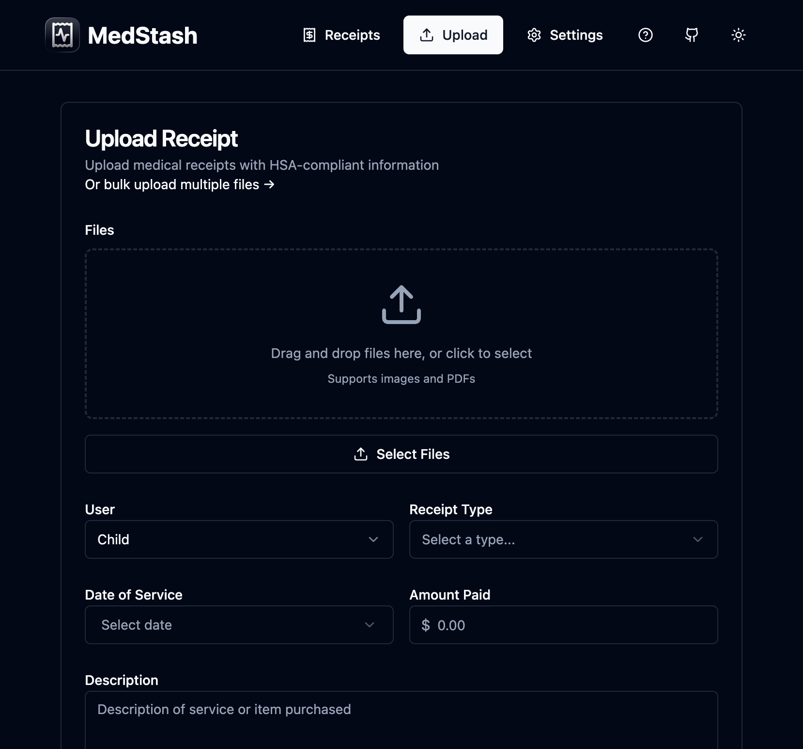
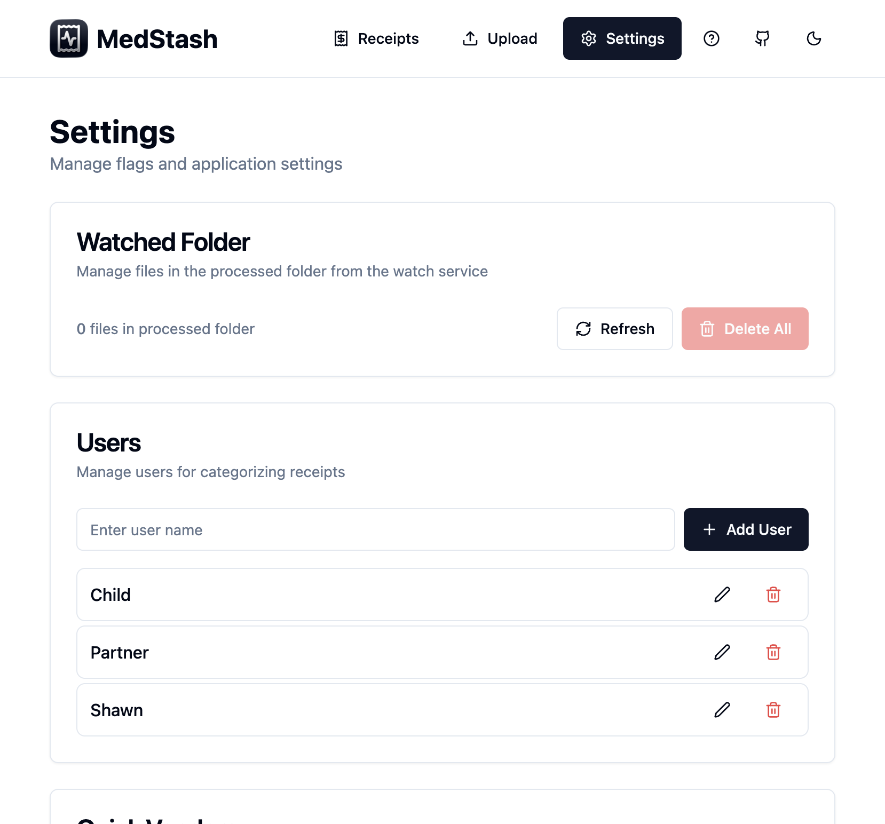
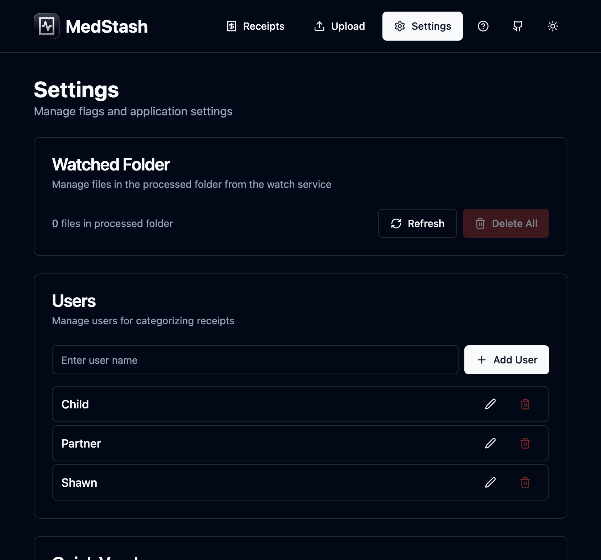
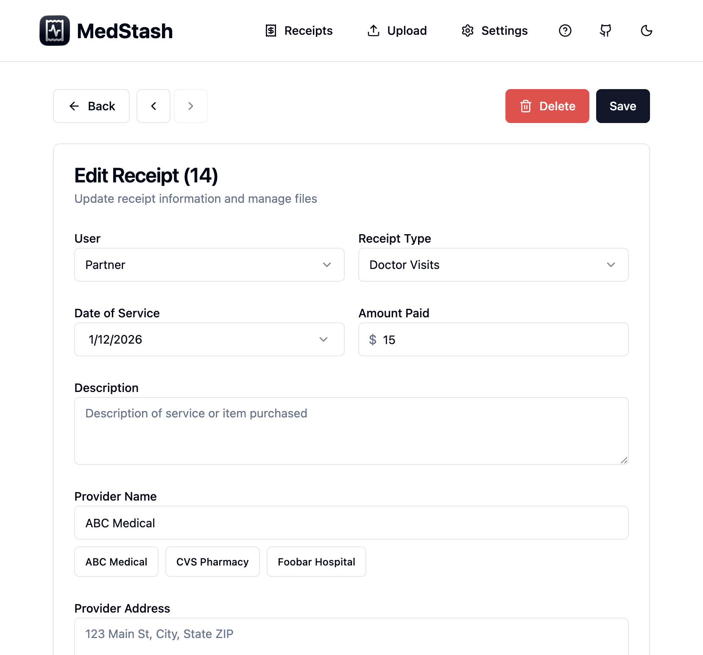
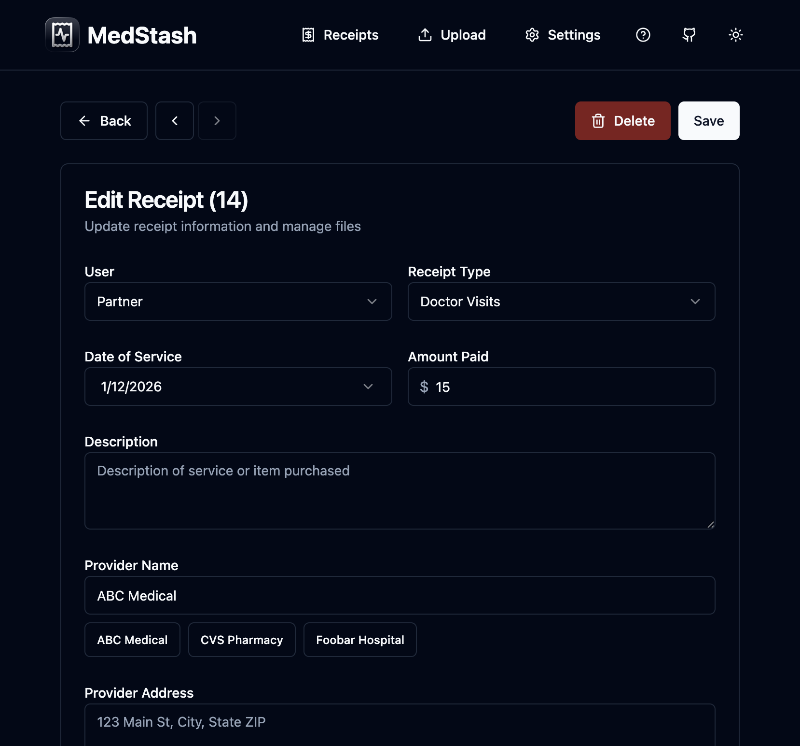

# MedStash
> [!IMPORTANT]
> This project started as a vibe-coding experiment but is slowly becoming more stable. Don't use without backups or with critical data. Do not expose publicly.

A dead simple, local-only receipt storage system for long-term HSA recordkeeping. Files stored on your filesystem, metadata in SQLite. No vendor lock-in.

## Features

- Multiple files per receipt (PDF and images)
- Custom flags for categorization
- Files stored directly on your filesystem
- SQLite database for metadata
- Automatic image optimization
- Bulk export functionality
- Docker deployment
- Dark mode

## Screenshots

#### Receipts Page
<table>
<tr>
<td></td>
<td></td>
</tr>
</table>

#### Upload Page
<table>
<tr>
<td></td>
<td></td>
</tr>
</table>

#### Settings Page
<table>
<tr>
<td></td>
<td></td>
</tr>
</table>

#### Receipt Detail Page
<table>
<tr>
<td></td>
<td></td>
</tr>
</table>

## Deployment

### Docker Compose

```bash
docker compose up -d
```

Access at `http://localhost:3020`

### Portainer

1. Create a new Stack
2. Copy contents of `docker-compose.yml`
3. Deploy

### Image Versions

Images are available at `ghcr.io/shawnphoffman/medstash`

- `:latest` - Latest from main branch
- `:v1.0.0` - Version tags
- `:main-{sha}` - Commit SHA tags

Use a specific version:
```bash
MEDSTASH_IMAGE_TAG=v1.0.0 docker compose up
```

## Configuration

### Environment Variables

See `env.example` for all available environment variables. Key variables:

- `PORT` - Server port (default: `3000`)
- `ALLOWED_ORIGINS` - CORS allowed origins, comma-separated (optional, if not set all origins are allowed)
- `UPLOAD_DIR` - Temporary upload directory (default: `/tmp/medstash-uploads`)

**Note:** Database and receipts are stored in `/data` by default. In Docker, mount your volume to `/data`.

### Docker Compose Variables

- `MEDSTASH_IMAGE_TAG` - Docker image tag (default: `latest`)
- `MEDSTASH_DATA_DIR` - Data storage path (default: `./data`)

## Data Storage

All data stored in `MEDSTASH_DATA_DIR` (default: `./data`):
- `db.sqlite` - SQLite database
- `receipts/` - Receipt files

Backup the `data/` directory to backup everything.

## Development

See [DEVELOPMENT.md](DEVELOPMENT.md) for development setup and documentation.

## License

MIT
