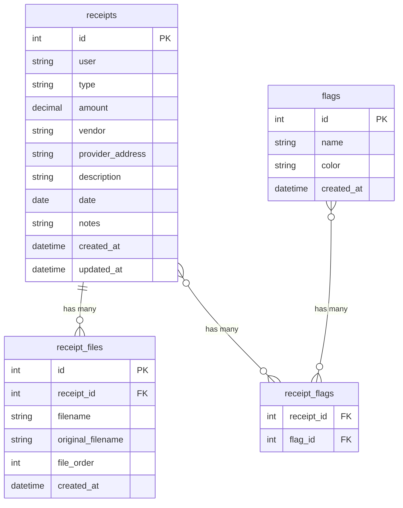

# Development Guide

This document contains information for developers working on MedStash, including local setup, architecture details, and testing.

## Local Development Setup

### Prerequisites

- Node.js 20+ and npm
- Docker and Docker Compose (for containerized development)

### Quick Start

#### Development with Docker (Recommended)

Start the development environment with hot reload:

```bash
# Start with file watching (recommended)
docker compose -f docker-compose.dev.yml watch

# Or start without watch (file changes still sync via volume mounts)
docker compose -f docker-compose.dev.yml up
```

This will start:
- **Backend** on `http://localhost:3001` with hot reload
- **Frontend** on `http://localhost:3010` with Vite dev server

#### Local Build (Testing Production Build)

For testing with a locally built image:

```bash
docker compose -f docker-compose.local.yml up
```

#### Development Without Docker

1. **Install dependencies**:
   ```bash
   # From project root
   npm install
   ```

2. **Start backend**:
   ```bash
   cd backend
   npm install
   npm run dev
   ```

3. **Start frontend** (in a new terminal):
   ```bash
   cd frontend
   npm install
   npm run dev
   ```

## Architecture Overview

MedStash is a full-stack application with React frontend and Node.js/Express backend, storing receipts as files on the filesystem with metadata in SQLite.

```
┌─────────────┐         ┌──────────────┐         ┌─────────────┐
│   React     │ ──────> │   Express    │ ──────> │   SQLite    │
│  Frontend   │         │    API      │         │  (metadata) │
│  (Vite)     │         │             │         └─────────────┘
└─────────────┘         │             │
                        │             │         ┌─────────────┐
                        │             │ ──────> │ Filesystem  │
                        │             │         │  (receipts) │
                        └─────────────┘         └─────────────┘
```

## Project Structure

```
/
├── frontend/
│   ├── src/
│   │   ├── components/
│   │   │   ├── ui/              # shadcn components
│   │   │   ├── ReceiptCard.tsx
│   │   │   ├── FlagBadge.tsx
│   │   │   ├── ThemeToggle.tsx
│   │   │   └── UserSetupDialog.tsx
│   │   ├── pages/
│   │   │   ├── UploadPage.tsx
│   │   │   ├── ReceiptsPage.tsx
│   │   │   ├── ReceiptDetailPage.tsx
│   │   │   └── SettingsPage.tsx
│   │   ├── lib/
│   │   │   ├── api.ts           # API client
│   │   │   └── utils.ts
│   │   ├── App.tsx
│   │   └── main.tsx
│   ├── package.json
│   ├── vite.config.mts
│   ├── tailwind.config.js
│   ├── components.json          # shadcn config
│   └── Dockerfile
├── backend/
│   ├── src/
│   │   ├── routes/
│   │   │   ├── receipts.ts      # CRUD for receipts
│   │   │   ├── flags.ts         # Flag management
│   │   │   ├── receiptTypes.ts  # Receipt type management
│   │   │   ├── filenames.ts     # Filename management
│   │   │   ├── settings.ts      # Settings management
│   │   │   ├── users.ts         # User management
│   │   │   └── export.ts        # Bulk export
│   │   ├── services/
│   │   │   ├── dbService.ts     # SQLite operations
│   │   │   └── fileService.ts   # File ops, optimization
│   │   ├── models/
│   │   │   └── receipt.ts       # Type definitions
│   │   ├── utils/
│   │   │   └── filename.ts       # Filename generation
│   │   ├── server.ts
│   │   └── db.ts                # DB initialization
│   ├── package.json
│   └── Dockerfile
├── docker-compose.yml            # Production setup (pulls from GHCR)
├── docker-compose.local.yml      # Local build setup
├── docker-compose.dev.yml        # Development with hot reload
└── README.md
```

## Database Schema

**SQLite Database** (`data/db.sqlite`):

- `receipts`: id, user, type, amount, vendor, provider_address, description, date, notes, created_at, updated_at
- `receipt_files`: id, receipt_id, filename, original_filename, file_order, created_at
- `flags`: id, name, color (optional), created_at
- `receipt_flags`: receipt_id, flag_id (many-to-many junction table)
- `settings`: key, value (JSON) - stores users list, receipt types, etc.

**Database Relationships**:



## File Storage

- Store in `/data/receipts/` (mounted volume)
- Each receipt can have multiple files (0:N relationship)
- Files stored in receipt-specific subdirectories: `/data/receipts/{receipt_id}/`
- Filename format per file: `YYYY-MM-DD_user_vendor_amount_type_{index}.ext`
- Sanitize filenames (remove special chars, handle spaces)
- Image optimization: Convert images to WebP with 85% quality using `sharp`
- Preserve PDFs as-is

## API Endpoints

- `GET /api/receipts` - List all receipts (with filters, flags)
- `POST /api/receipts` - Create receipt with multiple files (multipart/form-data)
- `GET /api/receipts/:id` - Get receipt details with files and flags
- `PUT /api/receipts/:id` - Update receipt metadata
- `POST /api/receipts/:id/files` - Add additional files to existing receipt
- `DELETE /api/receipts/:id` - Delete receipt and all associated files
- `GET /api/receipts/:id/files/:fileId` - Download specific receipt file
- `PUT /api/receipts/:id/flags` - Update flags for receipt (array of flag IDs)
- `GET /api/flags` - List all custom flags
- `POST /api/flags` - Create new flag
- `PUT /api/flags/:id` - Update flag
- `DELETE /api/flags/:id` - Delete flag
- `GET /api/settings` - Get settings
- `PUT /api/settings` - Update settings (users, types)
- `GET /api/export` - Generate zip archive of all receipts

## Frontend

**Pages**:
- **Upload Page**: Drag-and-drop multiple file upload with form for HSA-compliant metadata (user, type, amount, vendor, provider_address, description, date, notes) and flag selection
- **Receipts Page**: List view with search/filter by flags, receipt cards showing preview/thumbnail, display all files per receipt
- **Receipt Detail Page**: View individual receipt with all files and metadata
- **Settings Page**: Manage users list, receipt types, custom flags (create/edit/delete), view storage stats

**Tech Stack**:
- Vite for build tooling
- React Router for navigation
- react-hook-form for forms
- Tailwind CSS (via shadcn)
- axios for API calls
- shadcn/ui components

## Backend

**Tech Stack**:
- Express.js for API server
- better-sqlite3 for SQLite database
- multer for file uploads
- sharp for image optimization
- archiver for zip export

## Testing

See [TESTING.md](TESTING.md) for comprehensive testing documentation.

### Quick Test Commands

```bash
# Backend tests
cd backend && npm test

# Frontend tests
cd frontend && npm test

# Run all tests from root
npm test
```

## Docker Setup

### Development (`docker-compose.dev.yml`)

- Frontend: Vite dev server with volume mount for hot reload
- Backend: Node with file watching for auto-reload
- SQLite: Volume mount for persistence
- Receipts: Volume mount to `/data/receipts`

### Production (`docker-compose.yml`)

- Single container with built frontend and backend
- Frontend: Static files served via Express
- Backend: Production Node.js
- Volume mounts for data persistence

### Local Build (`docker-compose.local.yml`)

- Builds images locally instead of pulling from registry
- Useful for testing production builds before pushing

## File Naming Logic

Format: `YYYY-MM-DD_user_vendor_amount_type_{index}.ext`

Example: `2024-01-15_john-smith_cvs_25.50_prescription_0.pdf`, `2024-01-15_john-smith_cvs_25.50_prescription_1.jpg`

- Sanitize: lowercase, replace spaces with hyphens, remove special chars
- Index: Sequential number (0, 1, 2...) for multiple files per receipt
- Files stored in receipt-specific directory: `/data/receipts/{receipt_id}/`

## Image Optimization

- Use `sharp` library
- Convert JPEG/PNG to WebP format
- Quality: 85%
- Preserve aspect ratio
- Keep original if optimization fails

## Export Functionality

- Generate zip archive using `archiver`
- Include all receipt files
- Optionally include metadata CSV/JSON
- Stream response for large exports

## Custom Flags System

- Flags are user-defined tags for categorizing receipts
- Created and managed in Settings page
- Each flag has: name, optional color
- Receipts can have 0 to N flags (many-to-many relationship)
- Flags can be used for filtering and searching receipts
- Flags are stored in `flags` table with junction table `receipt_flags`

## Data Flow

1. **Upload**: User selects multiple files → Frontend sends multipart/form-data with metadata and flag IDs → Backend validates → Create receipt record → For each file: optimize image if needed → Generate filename → Save to receipt directory → Store file metadata in `receipt_files` → Link flags via `receipt_flags` → Return receipt object with files

2. **List**: Frontend requests receipts (optionally filtered by flags) → Backend queries SQLite with joins → Returns JSON with files and flags → Frontend renders cards

3. **Export**: Frontend requests export → Backend reads all receipt files from directories → Creates zip with organized structure → Streams to client

## Dependencies

**Backend**:
- express, cors, multer (file uploads)
- better-sqlite3 (SQLite)
- sharp (image optimization)
- archiver (zip export)

**Frontend**:
- react, react-dom, react-router-dom
- @radix-ui/* (shadcn dependencies)
- tailwindcss, class-variance-authority
- vite, typescript
- axios (API client)

## Building for Production

```bash
# Build frontend
cd frontend
npm run build

# Build backend
cd backend
npm run build

# Or use Docker
docker build -t medstash .
```

## Troubleshooting

### Port Conflicts

If ports 3001, 3010, or 3020 are already in use, modify the port mappings in `docker-compose.dev.yml` or `docker-compose.yml`.

### Database Issues

If you encounter database errors:
- Ensure the data directory is writable
- Check that SQLite file permissions are correct
- Try deleting `data/db.sqlite` to start fresh (⚠️ this will delete all data)

### File Upload Issues

- Check that the receipts directory is writable
- Verify disk space is available
- Check file size limits (configured in multer)

### Development Hot Reload Not Working

- Ensure volume mounts are correct in `docker-compose.dev.yml`
- Check that file watching is enabled
- Try restarting the containers

## Additional Resources

- [Vitest Documentation](https://vitest.dev/)
- [React Testing Library](https://testing-library.com/react)
- [Express.js Documentation](https://expressjs.com/)
- [shadcn/ui Documentation](https://ui.shadcn.com/)
